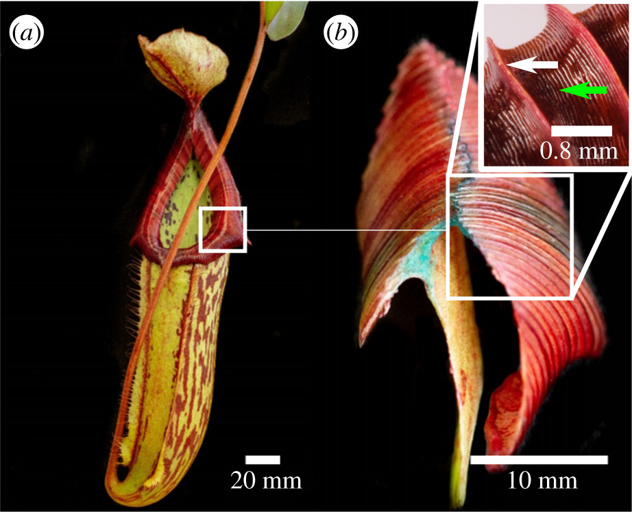

```{r setup, include=FALSE}
knitr::opts_chunk$set(echo = FALSE)
```



## Article (url) and words count

URL of the article:<https://phys.org/news/2019-09-pitfalls-synthetic-surfaces-pitcher-pitfall.html> (13 september 2019)
words: 579

## Vocabulary 

| Words from the text | Synonym/explanation in English | Translation in French|
| ------------------- | ------------------------------ |------------|
| Water-repellent     | Waterproof / Not easily penetrated by water, generally due to a surface coating. | Déperlant |
| Requirement         | Compulsary / Something that is needed, a necessary condition. | exigence, nécessité  |
| Lubricated          | Make slippery / Apply a substance (oil or grease) for minimizing the friction and obtaining smooth movement. | lubrifier, huiler |
| Carnivorous pitcher plant| Carnivorous plants / Plants that get some of their nutrients, from arthropods and insect, by consumming them. Pitcher plants have modified leaves known as pitfall traps, which contains a deep cavity filled with digestive liquids.| plante carnivore |
| Pitfall traps| Trap / A pit, usually concealed, used as a trap to lure insects or other small animals. | piège, piège à fosse |
| Peristome| - / An anatomical feature that surrounds an opening to an organ or structure; in our context the "mouth" of the carnivorous plant. | Péristome |
| Slopings| leaning / Inclined from a horizontal or vertical line. | Incliné, en pente |
| Ridges| arête / A long, narrow raised part of a surface. | crêtes, arêtes |
| Shortfall| lack / A failure to get what is expected or needed. | lacune |
| Droplets| drop of water / A small drop of liquid. | gouttelette |
| Liquid-shedding| water-repellent / Not easily pierced by water. | imperméable aux liquides |
| Harnessing| utilizing / To collect and control something so that it can be used efficently. | exploitation |
| Insights| overview / A deep understanding of something; can also be used to describe a quick peek into something. | aperçus |
| Grooves| rainure / A long, narrow space in the surface of a body part. | rainures |

## Analysis table 

|                              |                                                                     |
| ---------------------------- | ------------------------------------------------------------------- |
| Researchers                  | University of Oxford: Jian Guan (postdoctoral research assistant in fluid mechanics), Finn Box (Post-Doctoral Research Associate in fluid mechanics), Chris Thorogood (Deputy Director and Head of Science at Oxford Botanic Garden and Arboretum) |
| Published in?                | The Royal Society publishing (09/04/2019)                        |
| General topic?               | How can we take inspiration from the slippery peristome of carnivorous pitcher plants and use it to improve water transport.|
| Procedure/what was examined? | 1. Observation of different water-repellent natural surface (mostly the peristome of Nephentes, but also ants and flies).                        2. Creation of various models (trenches and steps),based on the previously studied surface and observation of the behaviour of liquids droplets on it.|
| Conclusions/discovery?       | The droplets in contact with the materials became strongly adhered (they wouldn't fall off easily) but could freely move alongside the groove even at shallow angles; allowing the liquid's movement to be controled to a certain extend.|
| Remaining questions?         | / |


