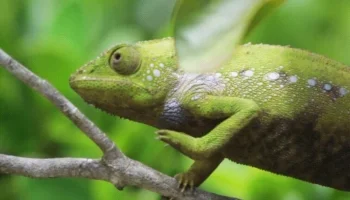

```{r setup, include=FALSE}
knitr::opts_chunk$set(echo = FALSE)
```



## Article (url) and word count

* URL of the article: <https://www.sciencedaily.com/releases/2019/08/190821111820.htm> (21 August 2019)

* word: 502

## Vocabulary 

| Words from the text | Synonym/explanation in English | Translation in French|
| ------------------- | ------------------------------ |------------|
| Skin | epidermis / The body's outer covering, formed of a thin layer of tissues. | épiderme |
| Applications | utilization / The action of putting something into operation. | applications |
| Dynamic dipslays | Interactive dipslays / An electronic device that uses pictures or data for visual presentation and, in our case, is able to react to it's environnment. | affichage dynamique |
| To coat | to cover / To provide with a layer of some sort on the skin(fur, clothes, shell,...). | recouvrir |
| Polymer | synthetic surface / A natural or synthetic substances composed of very large molecules, macromolecules, made of smaller one's (monomers). | polymère |
| To squeeze | to press / Manage to put inside a norrrow or small space. | compresser|
| Microdroplets | - / A very small drop. | micro gouttellette |
| Cuttlefish | cuttle / A swimming marine mollusc that resembles squid, it has eight arms and two long tentacles.  | seiche |
| Chromatophores | melanocytes (only for mammals and birds) / Cells or groups of cells that contains pigments and are able to reflect light. They can be found in a wide varieties  of animals: fish, reptiles,cephalopods... | chromatophores |
| Pigments | - / An organic compound that'll give colour to animal and plants tissues. | pigment |
| Elastic energy | strain energy / The mechanical potential energy stored in the configuration in a physical system leading to elastic deformation. | énergie de déformation |
| To bind | to cohere / Stick together a bunch of object into a single mass. | se lier |
| Clusters | bunch / A group of similar things combined together | amas |
| To load | To fill / To fill with a large amount of something. | remplir |
| To shadow | To overshdow / To cast a shadow over. | faire de l'ombre |
| Layer | film / The thickness of a material. | couche |
| Edge | extremity / The outside limit of an object. | bord |
| To peel | to skin / To remove a thin layer covering something. | se retirer |
| Illumination | light/ Lighting | illumination |
| Nanoscale | - / A scale of 10^9 metre. | échelle nanoscopique |
| Roll-to-roll films | R2R processing / Manufacturing technique involving continuous processing of a flexible substrate as it is transferred between two moving rolls. | - |
| To herd | To gather / To put together. | rassembler en troupeau |
| To fund | To finance /  To provide with money. | financer |

## Analysis table 

|                              |                                                                     |
| ---------------------------- | ------------------------------------------------------------------- |
| Researchers                  |    |
| Published in?                |    |
| General topic?               |    |
| Procedure/what was examined? |    |
| Conclusions/discovery?       |    |
| Remaining questions?         |    |
