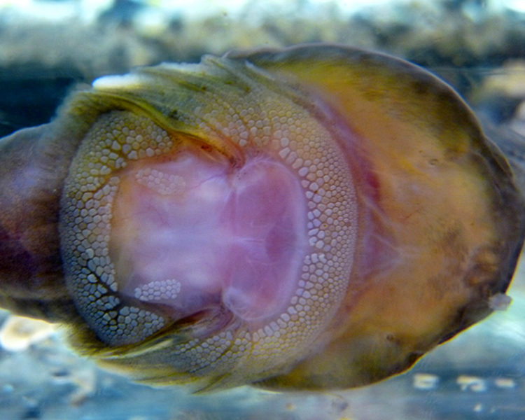

```{r setup, include=FALSE}
knitr::opts_chunk$set(echo = FALSE)
```



## Article (URL) and word count

* URL of the article: <https://www.sciencedaily.com/releases/2019/10/191016153631.htm> (16 October 2019)

* Word: 1014

## Vocabulary 

| Words from the text | Synonym/explanation in English | Translation in French|
| ------------------- | ------------------------------ |------------|
| Suction cup | Suction cap (British) / Piece of materials (plastic, rubber,...) designed to stick onto a surface using suction.| ventouse |
| Clingfish | Goby / Small fish found throughout the world (but very abundnt in the tropics), they have a weak suction cup on their belly.| gobie |
| Reverse engineering | back engineering / Process by wich an object is deconstructed in order to understand its working. | rétro-ingénierie |
| Device | instrument / A things made for a certain purpose. | appareil |
| To cling | To hold on / To stick to | s'accrocher |
| To grip | to seize / The act of grasping | s'aggriper |
| Artifact | artefact / Any object by a human, generally from an ancient times.| artéfact|
| Overarching | main / major | principale |
| Intricate | elaborate / With many interconnected parts | complexe |
| Outright | entirely / purely | purement et simplement |
| Intertidal | seashore / An area that is above water level at low tide and underwater at high tide | zone de balancement des marées |
| To batter | to beat / To hit repeatedly | frapper |
| Slit | cleavage / A narrow opening. | fente |
| Papillae | - / Protuberances of the dermal layer of the skin extending into the epidermal layer and often containing tactile corpuscles | papillae |
| Coarse sand paper | glasspaper / A sheets of paper with an abrasive face. | papier de verre |
| Conch | shell / The spiral shell of a gastropod. | conque |
| Remotely Operated Vehicle | ROV / Vehicles that are operated underwater and remotely controlled from the surface. | véhicule sous-marin téléguidé |
| Sample | specimen / A smaller part of larger whole. | échantillon |
| Asset | advantage / A useful and desirable thing. | atout |
| Footprint | mark / A mark left by a foot. | empreinte |
| Underlying | be the cause / That can be discoverd by a close analysis. | sous-jacent |
| Finite Element Analysis | FEM / The simulation of a physical phenomena using a computer program. | méthode des éléments finis |

## Analysis table

|                              |                                                                     |
| ---------------------------- | ------------------------------------------------------------------- |
| Researchers                  | University of California - San Diego: Jessica Alexandra Sandoval (Ph.D. student, Jacobs School of Engineering), Saurabh Jadhav (Mechanical & Aerospace Engineering, Jacobs School of Engineering), Haocheng Quan (Material characterization [graphene-based], Jacobs School of Engineering), Dimitri D. Deheyn (researcher in marine biology and biomimicry, Scripps Institution of Oceanography), Michael T. Tolley (robotics expert and professor, Jacobs School of Engineering)|
| Published in?                | Bioinspiration & Biomimetics; under the name:"Reversible adhesion to rough surfaces both in and out of water, inspired by the clingfish suction disc" (10/25/2019) |
| General topic?               | Creation of a suction cup inspired by the ventral adhesive disc of clingfish. |
| Procedure/what was examined? | 1) Collecting organisms (clingfish) in a Marine Reserve. 2) obersvation in laboratory. 3) Mimicking the attachment mechanism inside their prototypes by adding a soft layers - of microscopic pillars - and slits. 4) Testing the adhesive strenght on different surfaces with the Finite Element Analysis. |
| Conclusions/discovery?       | The device works on all kinds of surfaces (both in and out water). It can hold up to 350 times its weight and require very little force for the adhesion, allowing the suction cup to handle fragile object. The soft layers and the slits help clinging on uneven surfaces; even though the simplier design (without the pillars but with a thick layer of silicone) works better.|
| Remaining questions?         | / |

