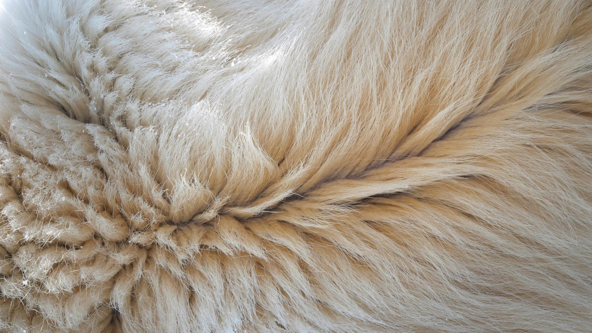

```{r setup, include=FALSE}
knitr::opts_chunk$set(echo = FALSE)
```



## Article (URL) and word count

* URL of the article: <https://www.sciencedaily.com/releases/2019/06/190606150317.htm> (06 June 2019)

* Word: 475

## Vocabulary 

| Words from the text | Synonym/explanation in English | Translation in French|
| ------------------- | ------------------------------ |------------|
| Insulation | - / The act of covering something to stop heat, sound, or electricity from escaping. | Isolation |
| Frigid | polar / Extremely cold. | Glacial |
| Template | device / A system that can be copied by other. | Modèle |
| To lock in | seal in / To keep inside, without allowing it to escape. | Verrouiller |
| Insulator | nonconductor / A material from which heat or electricity cannot escape. | Isolant |
|  To scale | - / To reproduce something at a greater or lower scale. | Produire à une plus grande ou plus petite échelle |
| Aerogel | frozen smoke / A solid material (of extremely low density) produced by removing the liquid component from a conventional gel. | aérogel |
| Analogous | akin / That have similar features. | Analogue |
| Hollow | empty / An empty space inside something. | Creux |
| Core | interior / The center of something | Noyau |
| Coats | fur / The hair that cover an animal's body. | Pelage |
| Outstanding | incredible / Excellent | Exceptionnel |
| To emulate | to imitate / To imitate something in order to mimic its properties. | Imiter |
| Strand of hair | Thread of hair / A single piece of hair. | Mèche de cheveux |
| To wind | to coil / To twist something around something else. | Enrouler |
| Heat flow | thermal flux  / Thermic energy (heat) that flows trough one's body, allowing its temperature to stay constant (in the case of homeotherms organisms). | Flux thermique |
| Hardly | rarely / Nearly never. | Rarement |
| Relevant | appropriate / Appropriate with the current thematic, goal. | Pertinent |

## Analysis table

|                              |                                                                     |
| ---------------------------- | ------------------------------------------------------------------- |
| Researchers                  | University of Science and Technology of China (USTC); they range from chemistry professor to mechanical engineering professor: Hui-Juan Zhan, Kai-Jin Wu, Ya-Lin Hu, Jian-Wei Liu, Han Li, Xu Guo, Jie Xu, Yuan Yang, Zhi-Long Yu, Huai-Ling Gao, Xi-Sheng Luo, Jia-Fu Chen, Yong Ni, Shu-Hong Yu. |
| Published in?                | Chem; under the name:"Biomimetic Carbon Tube Aerogel Enables Super-Elasticity and Thermal Insulation" (06/06/2019) |
| General topic?               | The creation of heat insulator materials inspired by polar bear fur. |
| Procedure/what was examined? | 1) Manufacture of millions of hollowed-out carbon tubes (each one of them equivalent to a single strand of polar bear's hair). 2) Coiling them together inside a spagethi-like aerogel block. |
| Conclusions/discovery?       | The synthetics hollowed carbons tubes are lighter and more resistant to heat flow than other aerogel or insulation components. They are also hardly affected by water and, in comparison with the genuine polar bear's hair, are stretchier. |
| Remaining questions?         | How can we bypass the size limitations of the carbon-tube materials in order to mass product them? |

