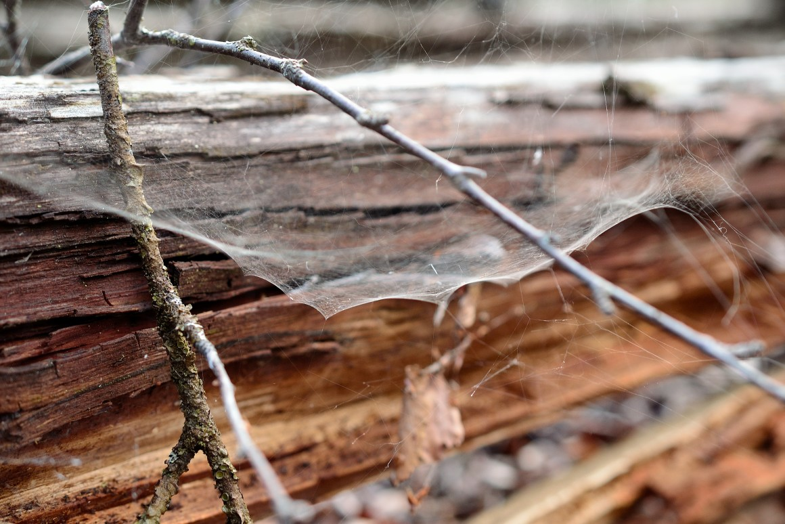

```{r setup, include=FALSE}
knitr::opts_chunk$set(echo = FALSE)
```



## Article (URL) and word count

* URL of the article: <https://www.sciencedaily.com/releases/2019/09/190916101845.htm> (16 September 2019)

* Word: 390

## Vocabulary 

| Words from the text | Synonym/explanation in English | Translation in French|
| ------------------- | ------------------------------ |------------|
| Extensibility | elasticity / The capacity to be extended or stretched. | extensibilité |
| To overcome | To defeat / To manage to deal with something. | surmonter |
| Cellulose | - / A natural compound found inside the cell walls of trees and plants. | cellulose |
| Silk | Spider silk (in our case) / A natural thread-like protein fiber produced by certain insects and spider.| soie |
| Spider web | cobweb / A structure created by spider made of sticky silk thread. | toile d'araignée |
| Threads | filament / A very thin fibre (made of wool, silk or cotton) | fil |
| Resilient | tough / Able to resist a large amount of strenght. | résistant |
| Composites | conglomerate / A material made up of multiple parts or materials. | composite |
| Available | disponible / Able to be used. | disponible |
| Biodegradable | environment-friendly / Able to get degrade naturally and without harming the surroundings. | biodégradable |
| Micro-plastic | non-degradable plastic / Extremely tiny pieces of plastic that aren't biodegradable. | micro-plastique |
| Property | characteristic / A specific quality, inherent of the material. | propriétes |
| Birch tree | birch / A tree with white barks and thin branch. | bouleau |
| Scaffold | Support / A structure made of scaffolding (metal poles and wooden boards), generally used to support. In our case this is a metaphore to talk about a supporting structure. | échaffaudage |
| Network | web / A system made of identical parts interconnected together. | réseau |
| Matrix | - / A substance in which particles are bind together. | matrice |
| DNA | Deoxyribonucleic acid / Chemical found in the cells of livings organisms, it contains genetic information. | ADN |
| Versatile | Changing / That can be use in a wide variety of way. | versatile |

## Analysis table

|                              |                                                                     |
| ---------------------------- | ------------------------------------------------------------------- |
| Researchers                  | Pezhman Mohammadi (Department of Bioproducts and Biosystems, Aalto University), A. Sesilja Aranko (Department of Bioproducts and Biosystems, Aalto University), Christopher P. Landowski (VTT Technical Research Centre of Finland Ltd), Olli Ikkala (Department of Bioproducts and Biosystems, Aalto University; Department of Applied Physics, School of Science, Aalto University), Kristaps Jaudzems (Latvian Institute of Organic Synthesis; Department of Chemistry, University of Latvia), Wolfgang Wagermaier (Department of Biomaterials, Max Planck Institute of Colloids and Interfaces), Markus B. Linder (Department of Bioproducts and Biosystems, Aalto University) |
| Published in?                | Science Advances; under the name: "Biomimetic composites with enhanced toughening using silk-inspired triblock proteins and aligned nanocellulose reinforcements" (09/13/19) |
| General topic?               | The creation of a new bio-based material made of "spider silk" and wood fibers. |
| Procedure/what was examined? | 1) Breaking down the tree pulp into cellulose nanofibrils. 2) Implementing a specific, synthetic, DNA in a bacteria, allowing the production of spider silk proteins. 3) Putting the silk matrix inside the nanofibrils web. 4) Aligning the nanofibrils, containing the silk, inside a rigid scaffold. |
| Conclusions/discovery?       | The newly created materials is very firm, resilient and biodegradable. The procedure could be used to manufacture similar composites but with different properties. |
| Remaining questions?         | / |


