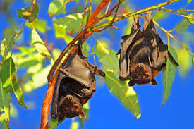

```{r setup, include=FALSE}
knitr::opts_chunk$set(echo = FALSE)
```




## Article (URL) and word count

* URL of the article: <https://phys.org/news/2020-01-detectors-oil-gas-pipe-leaks.html> (30 January 2020)

* Word: 665

## Vocabulary 

| Words from the text | Synonym/explanation in English | Translation in French|
| ------------------- | ------------------------------ |------------|
| To corrode | To damage / To be damaged by the action of chemicals, generally over a long period of time. | Corroder |
| Pipeline | Pipe / A long series of tube that travels underground and are used to trasport gas or oil over long distance. | Pipeline |
| Wavelength | - / The distance between two wave of energy. | Longueur d'onde |
| To leak | To escape / The escape of gas or liquid from a pipe due to a hole in the structure. | Fuiter |
| Backscatter | Diffusive reflection / The reflection of particles or waves back to the direction they came from. | Diffusion des ondes |
| To probe | To examinate / To investigate something in order to find hidden things. | Sonder |
| To retain | To preserve / To keep something. | Conserver |
| Beam | Ray / A ray of electromagnetic wave or particules. | Faisceau |
| Defect | Flaw / A problem or error that get in the way and prevent the good functionning of something. | Défaut |
| Array | Set / A group of things. | Eventail |
| To yield | To produce / To provide something that can be use. | Produire |
| Chirp | Sweep signal / High pitched sound produced, in this context, by bats which are able to bounce back to the ears of the bats. Allowing them to know the structure of their surroundings. | Ultrason |
| Analogous | Similar / Similar to another things in term of properties. | Analogue |

## Analysis table

|                              |                                                                     |
| ---------------------------- | ------------------------------------------------------------------- |
| Researchers                  | Lancaster university - doctorate in engineering: Mauro Licata, Michael Aspinall, Manuel Bandala Sanchez, F. D. Cave, S Conway, D. Gerta, Helen Parker, Neil Roberts, Graeme Taylor, Malcolm Joyce |
| Published in?                | Scientific Reports; under the name: "Depicting corrosion-born defects in pipelines with combined neutron/γ ray backscatter: a biometric approach" (01/07/20) |
| General topic?               | Scientists have discovered that a combination of neutron and gamma ray could be used to detect leaks inside pipelines in a similar manner to the echolocation used by bats. |
| Procedure/what was examined? | 1) The researchers tried to find out a way to detect corrosion in underground and isolated pipelines since the usual method of using electromagnetic or ultrasound aren't very practical for those. 2) They created a new technique, using the properties of both: neutron and gamma ray and their reflection. 3) Their new device produce a very thin beam of neutron and gamma ray and is capable of comparing the two electronic signals re-emitted by them.|
| Conclusions/discovery?       | This system allowed them to distinguish the thickness of steel and even worked with insulating materials (such as concrete and plastic), furthermore, any leaks inside the steel would result in a variation in the backscatter (making their localisation a lot faster). The new device could also be used for bridges.|
| Remaining questions?         | How can the speed of the system be improve. |

