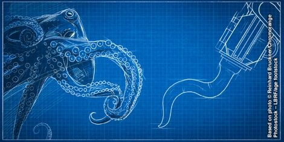

```{r setup, include=FALSE}
knitr::opts_chunk$set(echo = FALSE)
```



## Article (URL) and word count

* URL of the article: <https://www.sciencedaily.com/releases/2020/02/200227144222.htm> (27 february 2020)

* Word: 502

## Vocabulary 

| Words from the text | Synonym/explanation in English | Translation in French|
| ------------------- | ------------------------------ |------------|
| To untie | To unfasten / To untie the piece of strings that form a knot. | Délier |
| Knots | - / A join made by tying together two piece of strings. | Noeud |
| Suckers | Suction device / A special organ of an animal that allow him to stick to surfaces. | Ventouse |
| Seals | Sealant / An object that can be used in order to fill a gap, preventing things from escaping from the containers. | Joint |
| Tapered | Slender / To become narrower at the end. | Effilé |
| To grasp | To hold / To hold something firmly. | Saisir |
| To quantify | To measure / To measure to size or quantity of something. | Quantifier |
| To bend | To twist / To curve | Plier |
| Layout | - / The Tri-dimensionnal organisation of something. | Disposition |
| Actuators | - / A part of a machine that make an other part moves or work. | Actionneur |
| Counterpart | Peer / That is identitical or similar in term of appearance or characteristics to something. | Homologue |
| Valve | - / A device that open and close, allowing the flow of gas or liquid. | Vanne |
| To retrieve | To recover / To find and bring something back. | Récupérer |
| Insights | Overview / A deep understanding of something; can also be used to describe a quick peek into something. | Aperçus |

## Analysis table

|                              |                                                                     |
| ---------------------------- | ------------------------------------------------------------------- |
| Researchers                  | ->Harvard John A. Paulson School of Engineering and Applied Sciences (SEAS): August G. Domel, Ning An, Connor Green, Katia Bertoldi, James C. Weaver. ->Leitung Corporate Bionic Department, Festo SE & Co. KG, Germany: Elias M. Knubben. ->Beihang University, School of Mechanical Engineering and Automation:  Zhexin Xie, Zheyuan Gong,  Tianmiao Wang, Li Wen |
| Published in?                | Soft Robotics ; under the name: "Octopus Arm-Inspired Tapered Soft Actuators with Suckers for Improved Grasping." (02/25/20) |
| General topic?               | The creation of a soft robotic arm inspired by octopus tentacles. |
| Procedure/what was examined? | 1) Observation of the tapering angle of octopus tentacles. 2) Quantifying the perfect design for both grabbing and twisting objects for a soft robot. 3) Observation of the layout and structure of the suckers in order to make them part of the design. |
| Conclusions/discovery?       | The new robot is able to hold a wide variety of shape and textures. But can also, thanks to the vacuum, attach itself to an object, wrap around it, carry it, and release it; in fact the combination of bending and suction allow each sucker to perfom the task of multiple ones.|
| Remaining questions?         | - |

