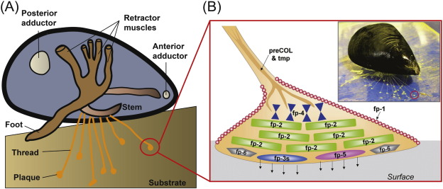

```{r setup, include=FALSE}
knitr::opts_chunk$set(echo = FALSE)
```


## Article (URL) and word count

* URL of the article: <https://phys.org/news/2020-02-heart-tissue-mussel-inspired-adhesive.html> (18 february 2020)

* Word: 479

## Vocabulary 

| Words from the text | Synonym/explanation in English | Translation in French|
| ------------------- | ------------------------------ |------------|
| Wind-swept | Windy / Exposed to strong winds. | Balayé par le vent |
| Wave-swept | - / Exposed to strong waves. | Balayé par les vagues |
| Stoically | Unshakable / Without showing signs of fatigue or weakness. | De manière stoique. |
| Jetty | - / A wooden structure put ashore allowing people to access boats. | Jetée |
| Firm | Secure / Strongly fixed in place. | Firme |
| Biocompatible | Compatible (when use in a medical context) / That is compatible with the human body and, as such, does not harm it. | Biocompatible |
| Congenital disorder | Genetic disorder / An illness, present from birth, that prevent an organ from working as intended. | Maladie congénitale |
| Hydrocolloid | - / A substance that create a gel in the presence of water. | Hydrocolloïde|
| Bursting strength | - / The hydrostatic pressure needed to burst a paperboard sample when it is applied uniformly across its side. | Résistance à l'éclatement |

## Analysis table

|                              |                                                                     |
| ---------------------------- | ------------------------------------------------------------------- |
| Researchers                  | Empa, Swiss Federal Laboratories for Materials Science and Technology, Switzerland : Kongchang Wei (Laboratory for Biomimetic Membranes and Textiles), Berna Senturk (Laboratory for Biointerfaces), Martin T. Matter (Laboratory for Particles-Biology Interactions), Xi WuInge (Institute for Mechanical Systems), K. Herrmann (Laboratory for Particles-Biology Interactions), Markus Rottmar (Laboratory for Biointerfaces), Claudio Toncelli (Laboratory for Biomimetic Membranes and Textiles) |
| Published in?                |  ACS Applied Materials & Interfaces ; under the name: "Mussel-Inspired Injectable Hydrogel Adhesive Formed under Mild Conditions Features Near-Native Tissue Properties" (11/25/19) |
| General topic?               | Researchers at the Swiss Federal Laboratories for Materials Science and Technology have develloped a mussel-inspired adhesive that could be used to repair body tissue. |
| Procedure/what was examined? | They equipped a gelatin biopolymers with chemical units (similar to the sea silk proteins found in mussel). |
| Conclusions/discovery?       | When the newly created gel comes in contact with a tissue, the structure of the protein cross-link with each other and establish a connection with the wound surfaces. Furthermore, this nature-inspired adhesive is capable of withstanding a pressure similar to human blood pressure.|
| Remaining questions?         | - |

